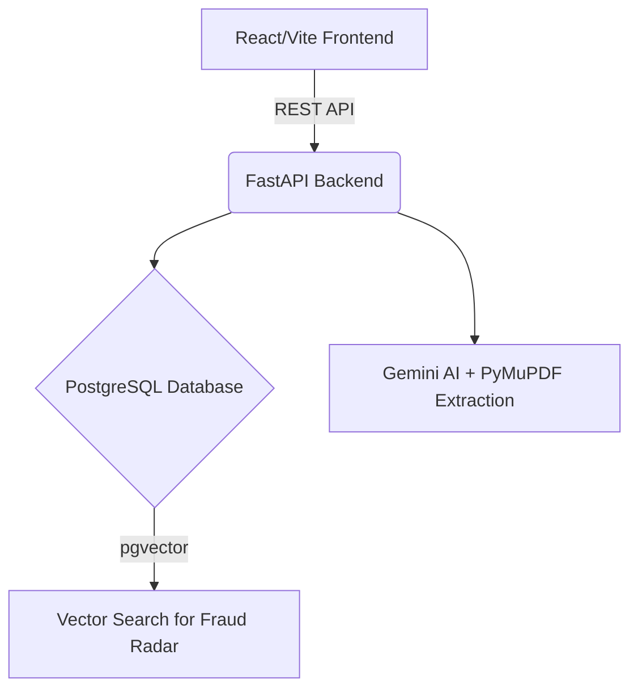

<div align="center">
  

  <br />

  [](https://git.io/typing-svg)

  <br />

  [](https://pravah-sigma.vercel.app/)
  [](https://pravah-j4a8.onrender.com/docs)
  [](https://opensource.org/licenses/MIT)
</div>

---

<div align="center">
  
</div>

**PRAVAH** is an intelligent, scalable, and responsive Single Window Clearance System. It is meticulously crafted to streamline industrial approvals, enhance the ease of doing business, and automate complex compliance workflows for investors and government officials alike.

---

## ✨ Core Features & Modules

<table align="center">
  <tr>
    <td align="center" width="50%">
      <h1>💻</h1>
      <b>Investor Dashboard & Analytics</b>
      <br />
      Comprehensive portal with stat tiles, performance charts, and integrated payment history.
    </td>
    <td align="center" width="50%">
      <h1>🔍</h1>
      <b>AI Document Verification (OCR)</b>
      <br />
      Automated Gemini AI & PyMuPDF pipeline for real-time name matching, expiry checks, and signature validation.
    </td>
  </tr>
  <tr>
    <td align="center" width="50%">
      <h1>🏭</h1>
      <b>Factory & MIDC Plot Setup</b>
      <br />
      Seamless management UI for factory units and industrial plot assignments.
    </td>
    <td align="center" width="50%">
      <h1>🪄</h1>
      <b>Investor Wizard & CAF</b>
      <br />
      Smart questionnaire dynamically generating the Common Application Form (CAF) required for approvals.
    </td>
  </tr>
  <tr>
    <td align="center" width="50%">
      <h1>🛡️</h1>
      <b>Fraud Radar & Duplicate Detection</b>
      <br />
      Identifies matching or near-matching fraudulent applications and documents before approval.
    </td>
    <td align="center" width="50%">
      <h1>💼</h1>
      <b>Officer SLA Dashboard</b>
      <br />
      Dedicated officer views, tracking Service Level Agreements (SLAs) and processing bottlenecks.
    </td>
  </tr>
  <tr>
    <td align="center" width="50%">
      <h1>💬</h1>
      <b>Smart Grievances & ChatBot</b>
      <br />
      Department-wise querying, feedback routing, and integrated AI assistant for rapid support.
    </td>
    <td align="center" width="50%">
      <h1>🌐</h1>
      <b>Multilingual & A11y</b>
      <br />
      Dynamic English/Marathi translations and global accessibility toggles (contrast/fonts).
    </td>
  </tr>
</table>

---

## 🛠️ Technology Stack

<div align="center">
  
  <br />
  <b>Frontend: React.js, Vite, Tailwind CSS, Framer Motion</b>
  <br /><br />
  
  <br />
  <b>Backend: Python 3.10+, FastAPI, Google Gemini AI, PostgreSQL (pgvector), SQLAlchemy, JWT</b>
</div>

---

## 📂 Architecture & Structure



```text
PRAVAH/
│
├── frontend/               # React UI Application
│   ├── src/components/     # Reusable UI elements
│   ├── src/features/       # Domain modules (documents, applications, officer, etc.)
│   └── src/contexts/       # Global state (Auth, Translations, Theme)
│
├── backend/                # FastAPI Application
│   ├── app/api/            # Route controllers
│   ├── app/models/         # SQLAlchemy schemas
│   └── app/services/       # Core business logic (OCR Service, Fraud Detection)
│
└── docs/                   # Detailed Architecture guides
```

---

## 📚 Documentation & Setup

Please refer to our detailed guides located in the `docs/` directory to run this project locally:

- 📖 [**SETUP.md**](docs/SETUP.md): Step-by-step guide to cloning, configuring the environment, and starting servers.
- 🏗️ [**ARCHITECTURE.md**](docs/ARCHITECTURE.md): An overview of the application architecture and RBAC logic.
- 🗄️ [**DATABASE.md**](docs/DATABASE.md): Instructions for managing PostgreSQL, migrations, and mock data seeding.
- 🔌 [**API.md**](docs/API.md): Documentation on core backend routes and authentication flows.

---

## 👨‍💻 Meet the CookedDevelopers Team

<table align="center">
  <tr>
    <td align="center">
      <a href="https://github.com/zakiali2006">
        
        <br />
        <b>Saiyyad Zaki Ali</b>
      </a>
    </td>
    <td align="center">
      <a href="https://github.com/VinayaKadate">
        
        <br />
        <b>Vinayak</b>
      </a>
    </td>
    <td align="center">
      <a href="https://github.com/bhagyesh-31">
        
        <br />
        <b>Bhagyesh</b>
      </a>
    </td>
  </tr>
  <tr>
    <td align="center">
      <a href="https://github.com/Student-kajalahire">
        
        <br />
        <b>Kajal</b>
      </a>
    </td>
    <td align="center">
      <a href="https://github.com/sheCodesAI">
        
        <br />
        <b>Niraja</b>
      </a>
    </td>
    <td align="center">
      <a href="https://github.com/shreyaa25-13">
        
        <br />
        <b>Shreya</b>
      </a>
    </td>
  </tr>
</table>

---

<div align="center">
  
  <h2>🚀 Built by the CookedDevelopers Team</h2>
  <p><b>Crafted with ❤️ for the Smart India Hackathon</b></p>
</div>
